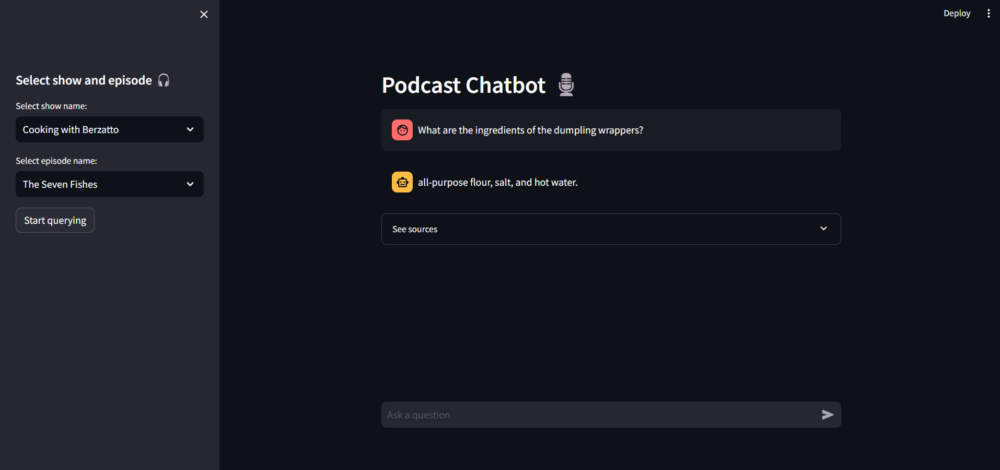
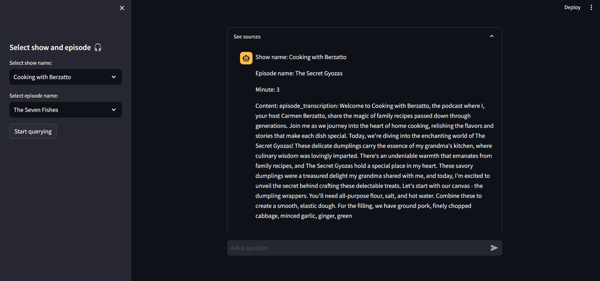

# Podcast QA-RAG

## Introduction
------------
The Podcast QA-RAG is an application that lets you chat with transcriptions of fictional podcasts. You can ask about any episode content using natural language, and the system will provide relevant responses from the documents. This project aims to enhance streaming apps, enabling users to ask questions about specific content of podcasts, eliminating the need to manually search for that information through the episodes.

The app is primarily built using LangChain, following the Retrieval Augmented Generation Framework. Weaviate is employed to create a vector database for indexing and querying the data. Additionally, a language model (local or API-based) generates coherent answers to user queries. The RAG system includes built-in memory to track conversations, and users can view retrieved sources for transparency purposes.

## How It Works
------------

The application follows these steps to provide responses to your questions:

1. Transcript Loading: The app reads multiple transcript (.csv) documents and extracts their text content.

2. Text Chunking: The extracted text is divided into smaller chunks that can be processed effectively.

3. Emmbedding Generation: The application utilizes an embedding model to generate vector representations of the text chunks.

4. Similarity Matching: When you ask a question, the app compares it with the text chunks and identifies the most semantically similar ones.

5. Response Generation: The selected chunks are passed to the language model, which generates a response based on the relevant content of the PDFs.

## Dependencies and Installation
----------------------------
To install the MultiPDF Chat App, please follow these steps:

1. Clone the repository to your local machine.

2. Install the required dependencies by running the following command:
   ```
   pip install -r requirements.txt
   ```

3. Obtain an API key from Weaviate and HuggingFaceHub and add them to the `.env` file in the project directory.
```
HUGGINGFACEHUB_API_TOKEN=your_secrit_api_key
WEAVIATE_API_KEY=your_secrit_api_key
WEAVIATE_URL=your_weaviate_url
```

## Usage
-----
To use the MultiPDF Chat App, follow these steps:

1. Ensure that you have installed the required dependencies and added the OpenAI API key to the `.env` file.

2. Run the `app.py` file using the Streamlit CLI. Execute the following command:
   ```
   streamlit run app.py
   ```

3. The application will launch in your default web browser, displaying the user interface.

4. Select a podast show and an episode or search through all transcripts.

5. Ask questions in natural language about the loaded transcripts using the chat interface.

## Snapshots
----------------------------
**Interface**

**See sources feature**


